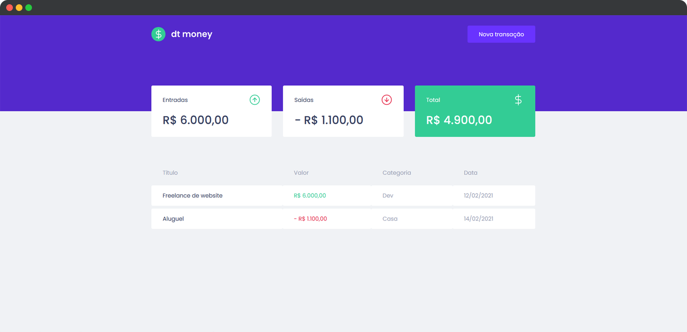

<h1 align="center">
  
</h1>

<p align="center">
  

  
</p>

<br>

<p align="center">
  
</p>

<br>

## 🧪 Tecnologias

Esse projeto foi desenvolvido com as seguintes tecnologias:

- [React](https://reactjs.org)
- [styled-components](https://styled-components.com/)
- [MirageJS](https://miragejs.com/)
- [Axios](https://github.com/axios/axios)
- [react-modal](https://github.com/reactjs/react-modal)
- [TypeScript](https://www.typescriptlang.org/)

## 💻 Projeto

O projeto tem como objetivo o estudo e desenvolvimento de uma aplicação em ReactJS aplicando conceitos utilizados no dia a dia de um desenvolvedor Front-end.

dt money foi desenvolvido utilizando hooks, contexto, comunicação com API utilizando o Axios e mirageJS para simular os responses do back-end. Foi implementado conceitos relacionados a tratamento de formulários e modal.

Este é um projeto desenvolvido como prática das aulas do Chapter II da trilha ReactJS do **[Programa Ignite](https://www.rocketseat.com.br/ignite)** da Rocketseat.

## 🚀 Como executar

Clone o projeto e acesse a pasta do mesmo.

```bash
$ git clone https://github.com/rafaelramosdev/ignite-reactjs-chapter-II-dt-money
$ cd ignite-reactjs-chapter-II-dt-money
```

Para iniciá-lo, siga os passos abaixo:

```bash
# Instala as dependências
$ yarn

# Inicia o website
$ yarn dev
```

O website estará disponível no seu navegador pelo endereço [`http://localhost:3000`](http://localhost:3000).

## 📄 Licença

Esse projeto está sob a licença MIT. Veja o arquivo [LICENSE](LICENSE) para mais detalhes.

---

Feito by [Rafael Ramos](https://rafaelramos.dev/) 🙋🏻‍♂️
